# Producto Integrador de Aprendizaje: Análisis geométrico automatizado en imágenes sintéticas para una celda de manufactura

## Portada

**Universidad Autónoma de Nuevo León**  
**Facultad de Ingeniería Mecánica y Eléctrica**  
**Asignatura:** Visión Computacional  
**Producto Integrador de Aprendizaje**  
**Título del proyecto:** Análisis geométrico automatizado en imágenes sintéticas para una celda de manufactura  
**Profesor:** [pendiente]  
**Integrantes:** [Nombre del integrante 1], [Nombre del integrante 2], [pendiente]  
**Grupo:** [pendiente]  
**Fecha:** [pendiente]

## Resumen

En este trabajo se desarrolló un sistema de visión computacional para el análisis geométrico automatizado de piezas mecánicas representadas en imágenes sintéticas, con el propósito de simular la etapa de percepción de una celda de manufactura con cámara fija. El enfoque parte de modelos CAD generados en FreeCAD, a partir de los cuales se construyó un conjunto de 20 piezas bidimensionales con distintas geometrías, perforaciones y orientaciones. Dichos modelos sirvieron simultáneamente como fuente de referencia geométrica y como base para la generación de imágenes HD de $1280 \times 720$ px sobre una mesa virtual de $320 \times 180$ mm.

La solución fue implementada con Python y las bibliotecas OpenCV, NumPy, Matplotlib y OpenPyXL. El procesamiento consistió en segmentación binaria, limpieza morfológica, extracción de contornos, cálculo del centroide mediante momentos de imagen, estimación de orientación a partir de momentos centrales, obtención de propiedades geométricas y clasificación por reglas. Posteriormente, el centroide detectado se transformó desde coordenadas de imagen al sistema local de la mesa y luego al sistema del robot mediante una transformación homogénea con traslación $W=(200,-50,400)$ mm y rotación $R=(0,-30,0)$ grados.

Los resultados experimentales muestran que el cálculo del centroide fue la salida más robusta del sistema, con error promedio de $0.2159$ mm y error máximo de $0.3536$ mm respecto a la referencia CAD. También se logró una discriminación geométrica funcional basada en propiedades morfológicas. En contraste, la comparación angular presentó variaciones elevadas, especialmente en piezas simétricas o con múltiples orientaciones equivalentes, por lo que la orientación por momentos debe interpretarse con cautela. El sistema no controla físicamente un robot; únicamente calcula las coordenadas y la orientación conceptual necesarias para una futura etapa de agarre robótico.

## Abstract

This work presents a computer vision system for automated geometric analysis of mechanical parts represented in synthetic images, aimed at simulating the perception stage of a manufacturing cell with a fixed camera. The approach starts from CAD models generated in FreeCAD, from which a set of 20 bidimensional parts with different geometries, holes, and orientations was created. These models were used both as geometric reference and as the basis for generating HD images of $1280 \times 720$ px on a virtual table of $320 \times 180$ mm.

The solution was implemented in Python using OpenCV, NumPy, Matplotlib, and OpenPyXL. The processing pipeline included binary segmentation, light morphological cleaning, contour extraction, centroid computation through image moments, orientation estimation from central moments, geometric property extraction, and rule-based classification. The detected centroid was then transformed from image coordinates to local table coordinates and later to robot coordinates through a homogeneous transformation with translation $W=(200,-50,400)$ mm and rotation $R=(0,-30,0)$ degrees.

Experimental results show that centroid estimation was the most robust output of the system, with an average error of $0.2159$ mm and a maximum error of $0.3536$ mm with respect to the CAD reference. Functional geometric discrimination was also achieved through morphological rules. In contrast, angular comparison showed large variations, especially for symmetric parts or shapes with multiple equivalent orientations, so moment-based orientation must be interpreted carefully. The system does not physically control a robot; it only computes the coordinates and conceptual orientation required for a future robotic grasping stage.

## Introducción

La visión computacional es una tecnología central en robótica industrial porque permite localizar piezas, estimar pose y generar información útil para automatizar etapas de inspección, manipulación y ensamble. En una celda robótica con cámara fija, el sistema visual debe transformar la información observada en la imagen en variables geométricas que puedan relacionarse con el espacio de trabajo del robot.

Dentro de ese contexto, conocer el centroide y la orientación de una pieza es especialmente importante. El centroide aproxima el punto de agarre o de referencia geométrica, mientras que la orientación ayuda a alinear la herramienta terminal con la pieza antes de una posible maniobra de sujeción. En una configuración *eye-to-hand*, la cámara se encuentra fija respecto a la celda, por lo que la conversión entre coordenadas de imagen, coordenadas de mesa y coordenadas del robot debe resolverse mediante calibración geométrica o transformaciones conocidas.

Una ventaja metodológica del presente PIA es el uso de imágenes sintéticas derivadas directamente de modelos CAD. Este enfoque permite disponer de referencias geométricas confiables, particularmente centroides y ángulos de diseño, sin introducir desde el inicio ruido óptico, distorsiones de lente o incertidumbre de iluminación propias de una cámara real. Así, el entorno sintético funciona como banco de pruebas controlado para validar los algoritmos de segmentación, análisis morfológico y transformación espacial.

En este proyecto, la mesa de trabajo se modeló con una dimensión de $320 \times 180$ mm, representada por imágenes de $1280 \times 720$ px. Además, la mesa se consideró desplazada e inclinada respecto al sistema universal del robot. Por ello, el procesamiento no se limitó a detectar la pieza en la imagen, sino que también convirtió el centroide estimado hacia coordenadas del sistema robótico. Esta salida no implica control físico del robot, pero sí produce las variables geométricas necesarias para una etapa conceptual de agarre robótico.

## Objetivos

### Objetivo general

Desarrollar un sistema de visión computacional en Python capaz de analizar imágenes sintéticas de perfiles mecánicos, calcular características morfológicas y transformar la posición del centroide al sistema de coordenadas de una celda robótica.

### Objetivos específicos

1. Generar una suite de 20 imágenes HD basadas en perfiles CAD.
2. Obtener valores de referencia de centroide e inclinación mediante FreeCAD.
3. Procesar las imágenes sintéticas con OpenCV.
4. Calcular el centroide de cada pieza mediante momentos de imagen.
5. Estimar la orientación de la pieza mediante momentos centrales de segundo orden.
6. Convertir coordenadas de imagen a coordenadas locales de mesa.
7. Transformar el centroide al sistema de coordenadas del robot mediante una matriz homogénea.
8. Discriminar figuras por medio de propiedades geométricas y reglas heurísticas.
9. Generar un cuadro experimental en CSV/XLSX, imágenes de resultado y gráficas de apoyo.

## Marco teórico

### 6.1 Visión computacional en celdas robóticas

En una celda robótica con cámara fija, la percepción visual se usa para obtener información sobre la posición y características geométricas de las piezas depositadas sobre una mesa de trabajo. El sistema de visión actúa como una etapa previa a la planificación de agarre: detecta la pieza, calcula un punto de referencia y estima una orientación útil para la herramienta. En este proyecto, esa información se expresa finalmente en coordenadas del sistema del robot, aunque no se ejecuta control físico sobre un manipulador.

### 6.2 Imágenes sintéticas y validación con CAD

El uso de imágenes sintéticas tiene la ventaja de desacoplar la validación geométrica del problema de adquisición real. En vez de depender de una cámara física, se parte de geometrías generadas en FreeCAD y se proyectan sobre imágenes limpias con escala conocida. De este modo, la referencia CAD funciona como *ground truth* para evaluar el desempeño del algoritmo visual. En el repositorio, esa referencia quedó almacenada en `resultados/cad_ground_truth.csv`, mientras que la geometría paramétrica se guardó en `resultados/cad_geometry.json`.

### 6.3 Segmentación y binarización

El primer paso del procesamiento es convertir la imagen de color a escala de grises y separar la pieza del fondo mediante umbralización binaria inversa. Como las imágenes sintéticas se generaron con fondo blanco y objeto oscuro, la binarización invierte intensidades para producir una máscara donde la pieza aparece en blanco y el fondo en negro. Este formato simplifica el cálculo de momentos y permite que los agujeros interiores permanezcan como regiones negras descontadas de la masa total.

### 6.4 Detección de bordes con Canny

El detector de Canny es uno de los métodos clásicos para extraer bordes por medio de suavizado, gradiente y umbralización con histéresis. En este proyecto, Canny se mantiene como herramienta útil para visualizar los límites de la pieza y reforzar la interpretación del contorno detectado. Sin embargo, la implementación final no usa la imagen de bordes para calcular el centroide, ya que eso podría hacer que bordes internos o agujeros compitan con el contorno principal. Por esa razón, el cálculo geométrico se realiza sobre la máscara binaria completa.

### 6.5 Momentos de imagen y centroide

Los momentos geométricos de una imagen binaria permiten resumir la distribución espacial de masa. Para una función de imagen $I(x,y)$, los momentos se expresan como:

$$
M_{ij} = \sum_x \sum_y x^i y^j I(x,y)
$$

El centroide se obtiene a partir de los momentos de primer orden:

$$
C_x = \frac{M_{10}}{M_{00}}, \qquad
C_y = \frac{M_{01}}{M_{00}}
$$

En este trabajo, el centroide se calcula directamente sobre la máscara binaria de la pieza. Esto significa que la masa proyectada se evalúa de forma completa y que las perforaciones se descuentan correctamente, lo cual era indispensable para comparar el resultado contra el centro de masa reportado por CAD.

### 6.6 Orientación por momentos centrales

La orientación del eje principal puede estimarse con momentos centrales de segundo orden:

$$
\theta = \frac{1}{2}\operatorname{atan2}(2\mu_{11}, \mu_{20} - \mu_{02})
$$

Este ángulo describe la dirección dominante de la distribución de masa proyectada. En piezas alargadas o marcadamente asimétricas, el eje principal suele ser consistente con una orientación funcional. No obstante, en piezas simétricas, casi circulares o con múltiples ejes equivalentes, el ángulo obtenido por momentos puede diferir considerablemente del ángulo de diseño asignado en CAD. Por ello, la comparación angular tiene limitaciones intrínsecas en círculos, polígonos regulares, bridas y engranes.

### 6.7 Transformación de coordenadas al sistema del robot

El flujo geométrico implementado en el proyecto es:

$$
\text{píxel} \rightarrow \text{coordenada local de mesa} \rightarrow \text{coordenada del robot}
$$

La conversión de píxeles a milímetros usa la relación entre dimensiones de imagen y dimensiones físicas de la mesa:

$$
x_{mesa} = (p_x - W_{img}/2)\left(\frac{W_{mesa}}{W_{img}}\right)
$$

$$
y_{mesa} = -(p_y - H_{img}/2)\left(\frac{H_{mesa}}{H_{img}}\right)
$$

Posteriormente, el punto se transforma al sistema del robot mediante una matriz homogénea:

$$
T_{mesa \rightarrow robot} = \text{Traslación}(W_x, W_y, W_z)\cdot \text{Rotación}(\theta,\phi,\psi)
$$

y el punto resultante se calcula como:

$$
P_{robot} = T_{mesa \rightarrow robot}\cdot P_{mesa}
$$

En el código se usó la convención $R = R_z(\psi)R_y(\phi)R_x(\theta)$ con traslación $(200,-50,400)$ mm y rotación $(0,-30,0)$ grados.

### 6.8 Discriminación geométrica

La discriminación geométrica se implementó mediante reglas, no mediante aprendizaje automático. Entre las propiedades calculadas se encuentran área, perímetro, relación de aspecto, `extent`, `solidity`, circularidad, número de agujeros y número de vértices aproximados. Estas variables permiten distinguir categorías generales, por ejemplo triángulos, hexágonos, piezas dentadas, placas alargadas, bridas y perfiles abiertos. El objetivo no fue identificar exactamente cada modelo CAD, sino demostrar que un conjunto de descriptores geométricos puede separar familias morfológicas de manera automática.

## Explicación de la estructura y desarrollo del trabajo

El flujo real implementado en el repositorio puede resumirse así:

```text
FreeCAD
→ cad_ground_truth.csv
→ cad_geometry.json
→ imágenes sintéticas HD
→ OpenCV
→ centroide, orientación y clasificación
→ conversión a coordenadas de mesa
→ transformación a coordenadas del robot
→ cuadro experimental CSV/XLSX
→ gráficas
→ imágenes procesadas
```

### 7.1 Generación de piezas CAD

La macro [`freecad_macros/generar_piezas_cad.FCMacro`](freecad_macros/generar_piezas_cad.FCMacro) construye 20 perfiles mecánicos a partir de puntos 2D y perforaciones definidas en milímetros. Cada perfil se extruye a un espesor de 3 mm, se rota en torno al eje $Z$ y se traslada sobre el plano de trabajo. Entre las piezas incluidas se encuentran: `circulo_con_agujero_central`, `triangulo_mecanico`, `hexagono_perforado`, `octagono_brida`, `engrane_12_dientes`, `engrane_18_dientes`, `estrella_dentada`, `brazo_mecanico_redondeado`, `placa_ranurada_larga`, `soporte_L_ancho`, `perfil_U_abierto`, `placa_cruz`, `base_irregular_tres_perforaciones`, `placa_trapezoidal`, `perfil_muescado`, `rombo_perforado`, `pentagono_mecanico`, `media_luna_tecnica`, `brida_rectangular_4_perforaciones` y `soporte_compuesto_irregular`.

La misma macro calcula el centro de masa de cada sólido, genera un marcador visual de centroide, agrega un eje de referencia y una línea azul asociada al ángulo CAD de diseño. Además, guarda los modelos `.FCStd` y exporta dos artefactos de referencia: `resultados/cad_ground_truth.csv` y `resultados/cad_geometry.json`.


### 7.2 Generación del dataset sintético

El script [`src/generar_dataset_desde_cad.py`](src/generar_dataset_desde_cad.py) lee `resultados/cad_geometry.json`, aplica a cada punto la misma rotación y traslación definidas en FreeCAD y rasteriza la geometría sobre imágenes de $1280 \times 720$ px. La conversión usa la escala:

$$
1280\ \text{px} \leftrightarrow 320\ \text{mm}, \qquad
720\ \text{px} \leftrightarrow 180\ \text{mm}
$$

lo que equivale a $4$ px/mm en ambos ejes. Los agujeros se dibujan como regiones blancas sobre el interior de la pieza, de manera coherente con la referencia geométrica.

### 7.3 Procesamiento OpenCV

El script [`src/vision.py`](src/vision.py) implementa el procesamiento principal:

1. Carga la imagen sintética.
2. La convierte a escala de grises.
3. Aplica una binarización inversa con umbral fijo.
4. Realiza una apertura morfológica con kernel $3 \times 3$.
5. Obtiene bordes con Canny para visualización.
6. Extrae el contorno exterior principal desde la máscara.
7. Calcula momentos sobre la máscara binaria completa.
8. Obtiene el centroide $(c_x,c_y)$.
9. Estima la orientación por momentos centrales.
10. Calcula una orientación alternativa con `minAreaRect`.
11. Extrae propiedades geométricas y clasifica la pieza por reglas.
12. Guarda una imagen anotada con contorno, centroide, eje principal, área, etiqueta CAD, clase geométrica, número de agujeros y vértices.

La decisión más importante de esta etapa es que el centroide y la orientación se calculan sobre la máscara binaria, no sobre los bordes de Canny. Esto evita tratar agujeros internos como si fueran objetos independientes y explica la alta precisión del centroide frente al CAD.


### 7.4 Comparación CAD vs Python

El script [`src/main.py`](src/main.py) recorre las 20 imágenes del dataset, consulta la referencia CAD en `resultados/cad_ground_truth.csv` y compara los resultados de visión contra los datos de FreeCAD. El centroide detectado se convierte de píxeles a milímetros dentro del sistema local de la mesa, se compara contra el centroide CAD y se reporta el error euclidiano. De igual manera, el ángulo obtenido por momentos se compara contra el ángulo de diseño, pero la diferencia angular se normaliza al rango $[-90^\circ, 90^\circ]$ para considerar la equivalencia de ejes.

Adicionalmente, el centroide detectado se transforma al sistema del robot mediante [`src/robot_transform.py`](src/robot_transform.py), que aplica una matriz homogénea asociada a la pose de la mesa. También se calcula una orientación conceptual del TCP compuesta por la inclinación de la mesa y la orientación observada de la pieza. Esta salida debe entenderse como información geométrica para una futura etapa de agarre robótico, no como control directo de un robot físico.

### 7.5 Generación de Excel y gráficas

El script [`src/generar_excel.py`](src/generar_excel.py) toma `resultados/cuadro_experimental.csv` y construye `resultados/cuadro_experimental.xlsx` con hojas de datos experimentales, resumen estadístico, discriminación geométrica, conteos de clasificación y configuración del sistema. Por su parte, [`src/generar_graficas.py`](src/generar_graficas.py) genera gráficas de error de centroide, comparación de centroides, error angular, coordenadas del robot y propiedades geométricas.

## Cuadro experimental

La tabla completa se encuentra en `resultados/cuadro_experimental.csv` y `resultados/cuadro_experimental.xlsx`. A continuación se muestra un extracto representativo de 8 casos:

| Imagen | Figura CAD | Clasificación Python | CAD X (mm) | CAD Y (mm) | Python X (mm) | Python Y (mm) | Error centroide (mm) | Ángulo CAD (°) | Ángulo Python (°) | Error angular (°) | Robot X (mm) | Robot Y (mm) | Robot Z (mm) | TCP $(\theta,\phi,\psi)$ |
|---|---|---:|---:|---:|---:|---:|---:|---:|---:|---:|---:|---:|---:|---|
| pieza_01.png | circulo_con_agujero_central | octagono_o_poligono_regular | 0.0000 | 0.0000 | -0.2500 | -0.0000 | 0.2500 | 0.0000 | 90.0000 | 90.0000 | 199.7835 | -50.0000 | 399.8750 | (0.0, -30.0, 90.0) |
| pieza_02.png | triangulo_mecanico | triangulo | -22.0000 | 12.0000 | -22.2500 | 12.2500 | 0.3536 | 18.0000 | 46.4481 | 28.4481 | 180.7309 | -37.7500 | 388.8750 | (0.0, -30.0, 46.4481) |
| pieza_03.png | hexagono_perforado | hexagono | 18.0000 | -8.0000 | 17.7500 | -8.0000 | 0.2500 | 35.0000 | 19.5492 | 15.4508 | 215.3720 | -58.0000 | 408.8750 | (0.0, -30.0, 19.5492) |
| pieza_04.png | octagono_brida | octagono_o_poligono_regular | -10.0000 | -12.0000 | -10.0000 | -12.0000 | 0.0000 | 52.0000 | 0.0000 | 52.0000 | 191.3397 | -62.0000 | 395.0000 | (0.0, -30.0, 0.0) |
| pieza_05.png | engrane_12_dientes | engrane_o_pieza_dentada_perforada | 22.0000 | 8.0000 | 21.7500 | 8.0000 | 0.2500 | 70.0000 | 87.4637 | 17.4637 | 218.8361 | -42.0000 | 410.8750 | (0.0, -30.0, 87.4637) |
| pieza_06.png | engrane_18_dientes | hexagono | -20.0000 | 0.0000 | -20.2500 | 0.2500 | 0.3536 | 88.0000 | -76.2380 | 15.7620 | 182.4630 | -49.7500 | 389.8750 | (0.0, -30.0, -76.2380) |
| pieza_07.png | estrella_dentada | perfil_abierto_o_irregular | 10.0000 | 15.0000 | 10.0000 | 15.2500 | 0.2500 | 105.0000 | 45.0000 | 60.0000 | 208.6603 | -34.7500 | 405.0000 | (0.0, -30.0, 45.0) |
| pieza_08.png | brazo_mecanico_redondeado | hexagono | -12.0000 | 15.0000 | -12.0000 | 14.7500 | 0.2500 | 125.0000 | 54.8725 | 70.1275 | 189.6077 | -35.2500 | 394.0000 | (0.0, -30.0, 54.8725) |

### Resumen estadístico

| Variable | Valor |
|---|---:|
| Número de imágenes procesadas | 20 |
| Error promedio de centroide (mm) | 0.2159 |
| Error máximo de centroide (mm) | 0.3536 |
| Error mínimo de centroide (mm) | 0.0000 |
| Error promedio angular (°) | 45.7659 |
| Error máximo angular (°) | 90.0000 |
| Error mínimo angular (°) | 8.7031 |
| Área promedio detectada (px²) | 125178.4 |
| Área máxima detectada (px²) | 170608.0 |
| Área mínima detectada (px²) | 67236.0 |

## Resultados

### 9.1 Resultados visuales del procesamiento

Cada imagen procesada incluye el contorno exterior, el centroide detectado, el eje principal por momentos, el ángulo calculado, el área en píxeles cuadrados, la figura CAD de referencia, la clasificación geométrica estimada por Python y el número de agujeros y vértices aproximados. Estas salidas muestran que el sistema no solo segmenta la pieza, sino que también genera un resumen geométrico útil para análisis posterior.

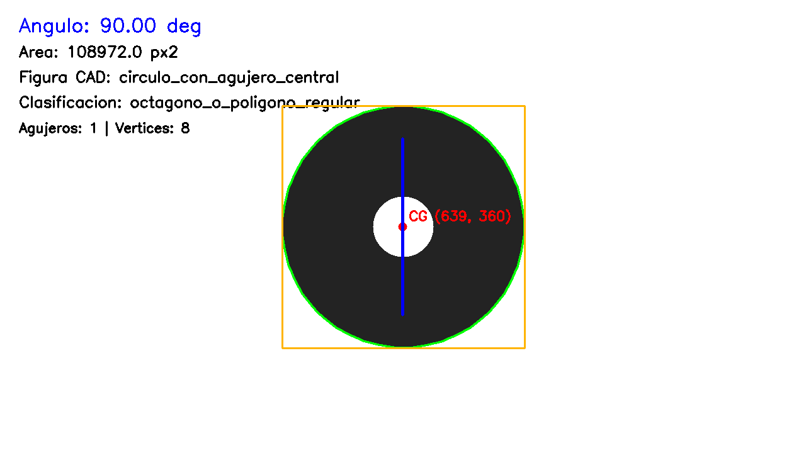
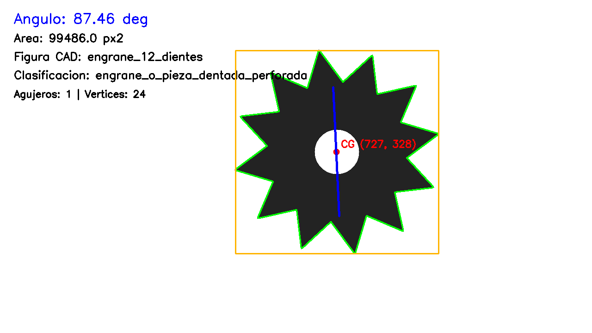
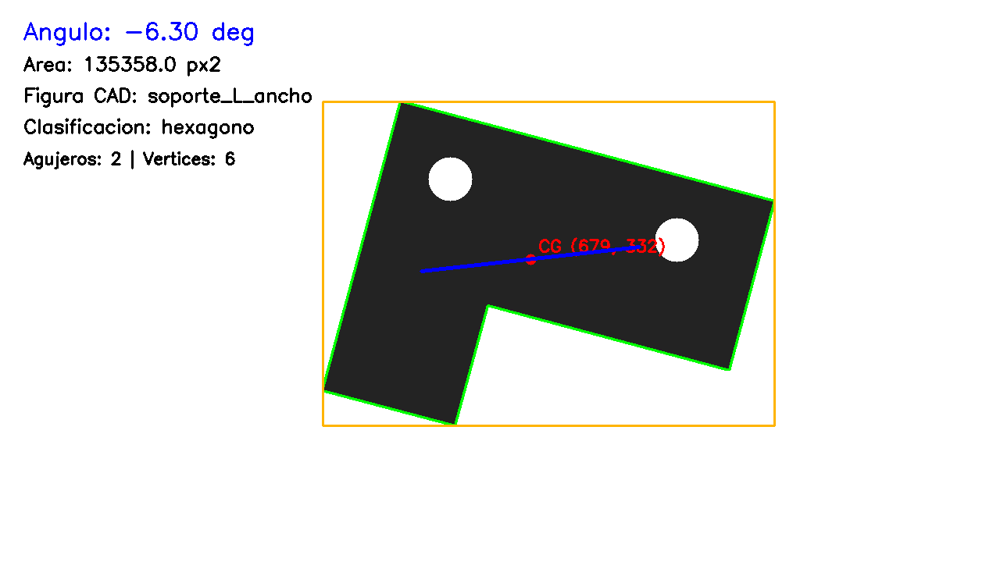
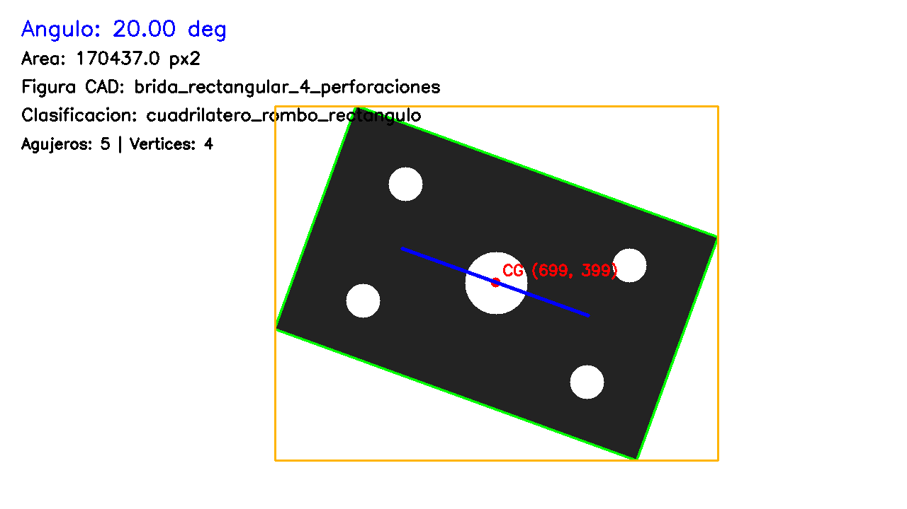

### 9.2 Precisión del centroide

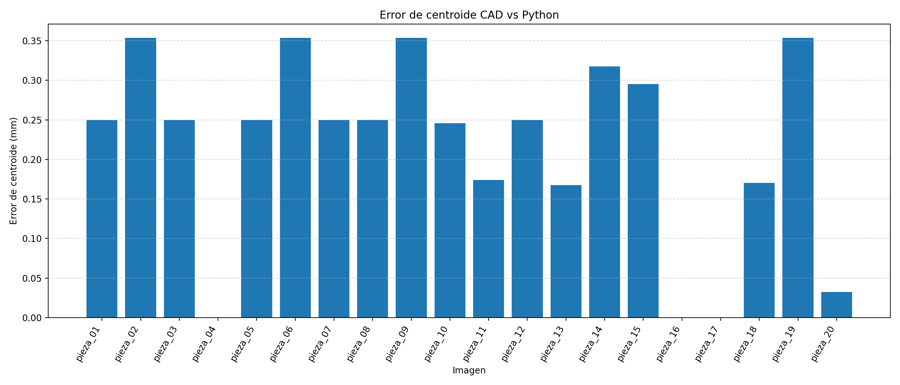
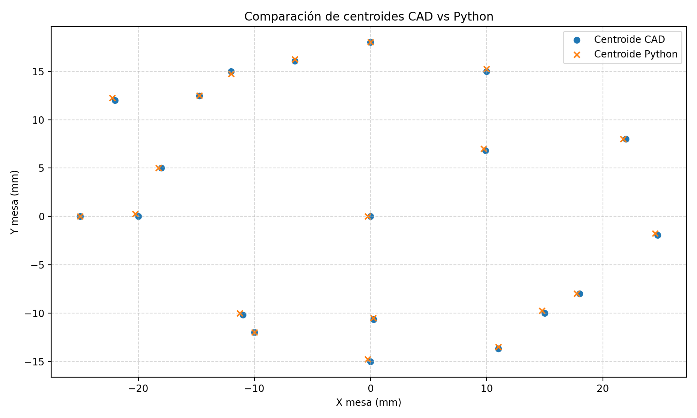

La gráfica de error de centroide muestra un comportamiento consistentemente bajo para las 20 piezas. El error máximo fue de $0.3536$ mm y el promedio de $0.2159$ mm. Dado que la escala del sistema es de $4$ px/mm, el peor caso equivale aproximadamente a $1.41$ px, lo que indica que la discrepancia entre el centroide detectado y el centroide CAD es pequeña. Casos como `pieza_04.png` presentan error nulo, mientras que otros como `pieza_02.png`, `pieza_06.png`, `pieza_09.png` y `pieza_19.png` alcanzan el máximo observado, pero permanecen dentro de un margen submilimétrico a escala de mesa.

La comparación espacial entre centroides CAD y Python confirma que ambos conjuntos prácticamente se superponen. Esto respalda que el cálculo de momentos sobre la máscara binaria completa fue adecuado y que el centroide constituye la salida más robusta del sistema.

### 9.3 Transformación a coordenadas del robot

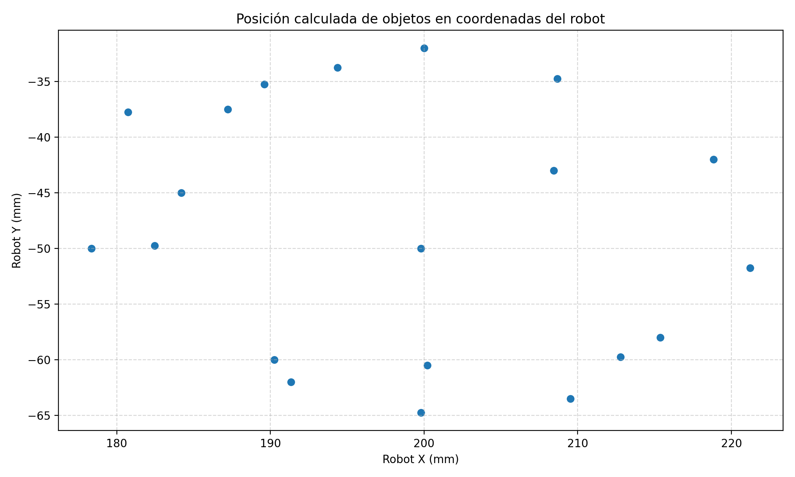

La distribución de puntos transformados al sistema del robot se mantiene dentro de la región esperada a partir de la geometría de la mesa y de la traslación impuesta. Esto indica que el flujo de conversión `píxel → mesa → robot` es consistente y que las coordenadas obtenidas son apropiadas como información de entrada para una etapa posterior de planeación de agarre. Conviene subrayar que el sistema no acciona físicamente un robot; únicamente calcula coordenadas y orientación conceptual del TCP.

### 9.4 Discriminación geométrica

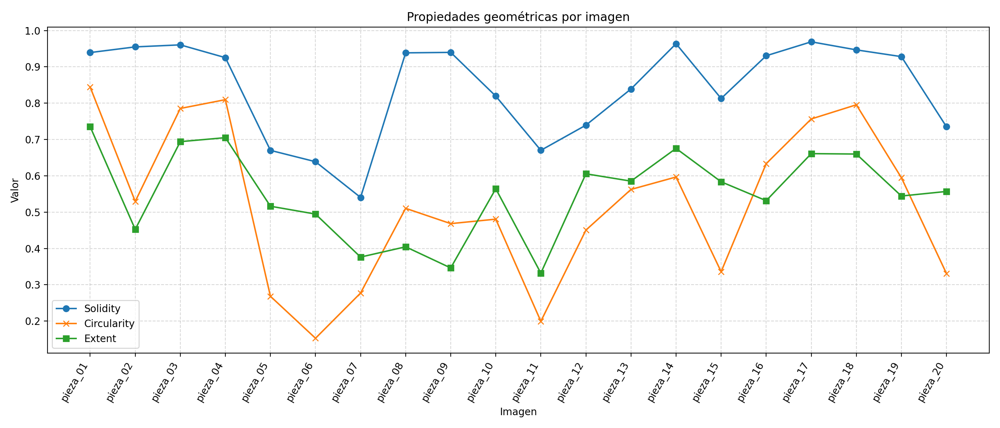
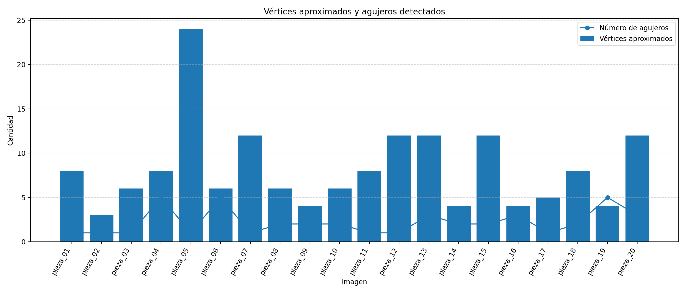
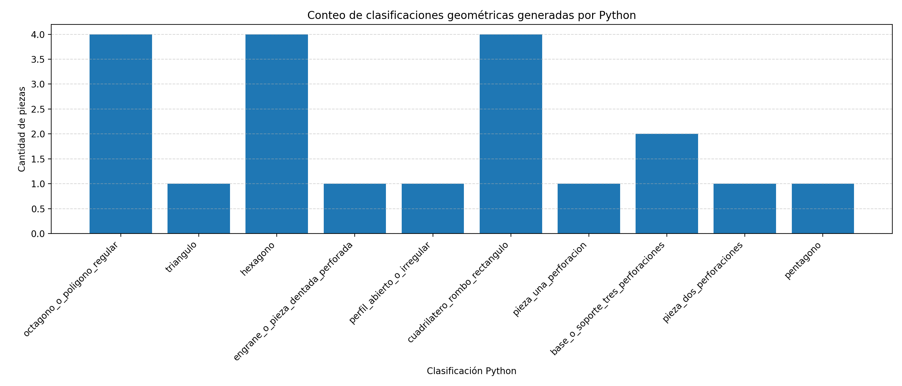

Las gráficas de propiedades geométricas muestran variaciones útiles en `solidity`, `circularity` y `extent`, lo que permitió separar diferentes familias morfológicas. El conteo final arrojó, entre otras categorías, 4 casos clasificados como `octagono_o_poligono_regular`, 4 como `hexagono`, 4 como `cuadrilatero_rombo_rectangulo`, 2 como `base_o_soporte_tres_perforaciones` y 1 caso para clases más específicas como `triangulo`, `pentagono` o `engrane_o_pieza_dentada_perforada`.

Estos resultados evidencian que la discriminación por reglas fue funcional para agrupar piezas por comportamiento geométrico. Sin embargo, también dejan claro que esta estrategia no equivale a reconocimiento exacto del modelo CAD, ya que algunas piezas mecánicas complejas fueron absorbidas por clases generales debido a la similitud de sus descriptores proyectados.

### 9.5 Orientación angular

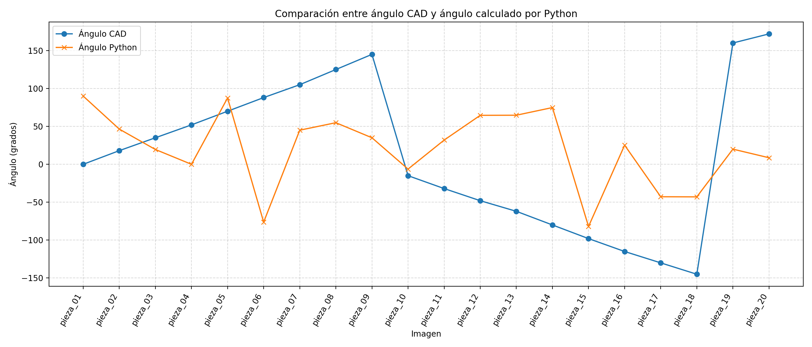
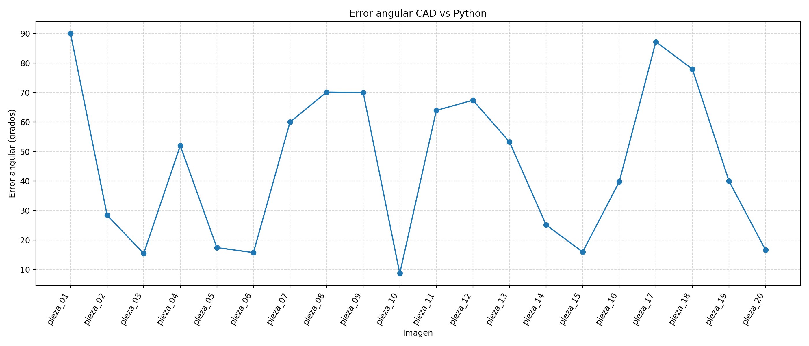

La orientación angular fue la variable con mayor dispersión. El error angular promedio fue de $45.7659^\circ$, con máximo de $90.0^\circ$ y mínimo de $8.7031^\circ$. El caso más crítico corresponde a `pieza_01.png` (`circulo_con_agujero_central`), donde el ángulo CAD fue $0^\circ$ y el ángulo por momentos $90^\circ$, diferencia que no debe interpretarse como una falla estricta, sino como evidencia de ambigüedad angular en una geometría radialmente simétrica. Otras piezas con errores elevados incluyen `pentagono_mecanico`, `media_luna_tecnica`, `brazo_mecanico_redondeado` y `placa_ranurada_larga`.

La explicación técnica es que el ángulo CAD representa la orientación de diseño aplicada en FreeCAD, mientras que el ángulo Python expresa el eje principal de distribución de masa. Cuando una pieza posee múltiples ejes equivalentes o una simetría fuerte, ambos conceptos dejan de ser directamente comparables. Por ello, la orientación calculada por momentos es más representativa en piezas alargadas o asimétricas con un eje dominante bien definido.

## Discusión

El resultado más sólido del proyecto fue el cálculo del centroide. La razón principal es que el centro de masa proyectado depende de la distribución completa de la pieza y puede capturarse de manera estable con momentos sobre la máscara binaria. Dado que las imágenes sintéticas tienen contraste alto, escala controlada y ausencia de ruido óptico, el proceso de segmentación introduce muy poca incertidumbre. Además, el uso de una apertura morfológica ligera ayuda a estabilizar la máscara sin deformar de forma importante la geometría.

La orientación angular, en cambio, presentó variabilidad considerable. Esto no solo se debe al algoritmo, sino a la naturaleza del problema. El ángulo impuesto en CAD no siempre coincide con el eje principal de una distribución de masa bidimensional. En figuras simétricas, la orientación es ambigua; en piezas complejas, la geometría proyectada puede favorecer un eje dominante diferente al esperado desde el diseño. Por esa razón, la comparación angular debe interpretarse como una evaluación cualitativa y condicionada por la simetría de la pieza.

Otro punto relevante es el tratamiento de los agujeros. Si el centroide se hubiera calculado sobre bordes o contornos parciales, las perforaciones internas podrían distorsionar el resultado o incluso ser interpretadas como elementos independientes. La implementación final evita ese problema al operar sobre la máscara binaria completa. Por esta misma razón, Canny se conservó principalmente como apoyo visual y no como base numérica del centroide.

La clasificación geométrica por reglas fue suficiente para demostrar discriminación morfológica, pero no para reconocimiento preciso de identidad. Varias piezas fueron agrupadas en categorías genéricas como `hexagono` u `octagono_o_poligono_regular`, lo cual es razonable desde el punto de vista de sus descriptores proyectados, aunque insuficiente si el objetivo fuera reconocer exactamente cada pieza CAD.

Entre las mejoras posibles se proponen las siguientes:

1. Incorporar calibración real de cámara y corrección de distorsión.
2. Introducir referencias visuales como ArUco o un patrón de calibración.
3. Separar la evaluación angular entre piezas simétricas y asimétricas.
4. Definir en CAD ejes funcionales de agarre para una comparación angular más pertinente.
5. Implementar clasificadores de aprendizaje automático o descriptores más discriminantes.
6. Extender el proyecto hacia simulación de cinemática inversa y planeación de agarre.

## Conclusiones

1. Se cumplió la generación de 20 imágenes HD a partir de modelos CAD construidos en FreeCAD.
2. El uso de referencia CAD real permitió validar cuantitativamente el desempeño del sistema visual.
3. El centroide fue calculado con alta precisión respecto al CAD, con error promedio de $0.2159$ mm y error máximo de $0.3536$ mm.
4. La transformación de coordenadas desde imagen hasta el sistema del robot funcionó de forma consistente y generó posiciones útiles para una etapa conceptual de agarre robótico.
5. El sistema produjo una orientación conceptual del TCP basada en la inclinación de la mesa y en la orientación estimada de la pieza.
6. La discriminación geométrica por propiedades morfológicas fue funcional para separar familias de piezas, aunque no equivale a reconocimiento exacto del modelo.
7. El proyecto generó correctamente el cuadro experimental en CSV/XLSX, imágenes procesadas y gráficas de análisis.
8. La comparación angular requiere interpretación cuidadosa, sobre todo en piezas simétricas o con orientaciones equivalentes, por lo que el centroide debe considerarse la salida más robusta del sistema.
9. El sistema no controla físicamente un robot; calcula las coordenadas y la orientación necesarias para una posible etapa posterior de agarre robótico.

## Referencias y bibliografía

Se recomienda validar el formato final con el estilo bibliográfico exigido por el curso. Las siguientes referencias son adecuadas para documentar la base técnica del proyecto:

1. OpenCV, "Canny Edge Detection," OpenCV Documentation. Disponible en: [https://docs.opencv.org/3.4/da/d22/tutorial_py_canny.html](https://docs.opencv.org/3.4/da/d22/tutorial_py_canny.html)
2. OpenCV, "Image Moments," OpenCV Documentation. Disponible en: [https://docs.opencv.org/4.x/d0/d49/tutorial_moments.html](https://docs.opencv.org/4.x/d0/d49/tutorial_moments.html)
3. OpenCV, "Contours: Getting Started," OpenCV Documentation. Disponible en: [https://docs.opencv.org/3.4/d4/d73/tutorial_py_contours_begin.html](https://docs.opencv.org/3.4/d4/d73/tutorial_py_contours_begin.html)
4. OpenCV, "Structural Analysis and Shape Descriptors," OpenCV Documentation. Disponible en: [https://docs.opencv.org/4.x/d3/dc0/group__imgproc__shape.html](https://docs.opencv.org/4.x/d3/dc0/group__imgproc__shape.html)
5. FreeCAD Team, "FreeCAD: Your own 3D parametric modeler," FreeCAD Official Site. Disponible en: [https://www.freecad.org/index.php?lang=en_US](https://www.freecad.org/index.php?lang=en_US)
6. Y. Van Havre, *A FreeCAD Manual*. FreeCAD Documentation. Disponible en: [https://www.freecad.org/manual/a-freecad-manual.pdf](https://www.freecad.org/manual/a-freecad-manual.pdf)
7. R. Szeliski, *Computer Vision: Algorithms and Applications*, 2nd ed. London, U.K.: Springer, 2022.
8. R. C. Gonzalez y R. E. Woods, *Digital Image Processing*, 4th ed. Pearson, 2018.
9. J. J. Craig, *Introduction to Robotics: Mechanics and Control*, 4th ed. Pearson, 2017.
10. P. Corke, *Robotics, Vision and Control*, 2nd ed. Cham, Switzerland: Springer, 2017.

## Anexos

### Anexo A. Estructura de carpetas del proyecto

```text
PIA_Vision_Computacional/
├── cad/
│   └── modelos/
├── dataset/
│   └── originales/
├── freecad_macros/
│   └── generar_piezas_cad.FCMacro
├── resultados/
│   ├── cad_geometry.json
│   ├── cad_ground_truth.csv
│   ├── cuadro_experimental.csv
│   ├── cuadro_experimental.xlsx
│   ├── graficas/
│   └── imagenes_resultado/
├── src/
│   ├── generar_dataset_desde_cad.py
│   ├── generar_excel.py
│   ├── generar_graficas.py
│   ├── main.py
│   ├── robot_transform.py
│   └── vision.py
└── reporte_pia_vision_computacional.md
```

### Anexo B. Descripción de scripts

| Archivo | Función principal |
|---|---|
| `freecad_macros/generar_piezas_cad.FCMacro` | Genera las 20 piezas CAD, calcula centroide/ángulo de referencia y exporta `cad_ground_truth.csv` y `cad_geometry.json`. |
| `src/generar_dataset_desde_cad.py` | Convierte geometría CAD a imágenes sintéticas HD con escala física conocida. |
| `src/vision.py` | Segmenta la pieza, calcula centroide, orientación, propiedades geométricas y clasificación por reglas. |
| `src/main.py` | Ejecuta el procesamiento de todo el dataset, compara contra CAD y genera `cuadro_experimental.csv`. |
| `src/robot_transform.py` | Convierte coordenadas de imagen a mesa y de mesa a robot mediante transformación homogénea. |
| `src/generar_excel.py` | Crea el archivo `cuadro_experimental.xlsx` con hojas de datos, resumen y gráficas internas. |
| `src/generar_graficas.py` | Genera las gráficas PNG a partir del cuadro experimental. |

### Anexo C. Extracto de fórmulas

$$
M_{ij} = \sum_x \sum_y x^i y^j I(x,y)
$$

$$
C_x = \frac{M_{10}}{M_{00}}, \qquad C_y = \frac{M_{01}}{M_{00}}
$$

$$
\theta = \frac{1}{2}\operatorname{atan2}(2\mu_{11}, \mu_{20} - \mu_{02})
$$

$$
x_{mesa} = (p_x - W_{img}/2)\left(\frac{W_{mesa}}{W_{img}}\right), \qquad
y_{mesa} = -(p_y - H_{img}/2)\left(\frac{H_{mesa}}{H_{img}}\right)
$$

$$
P_{robot} = T_{mesa \rightarrow robot}\cdot P_{mesa}
$$

### Anexo D. Capturas adicionales de FreeCAD


### Anexo E. Capturas adicionales del procesamiento OpenCV

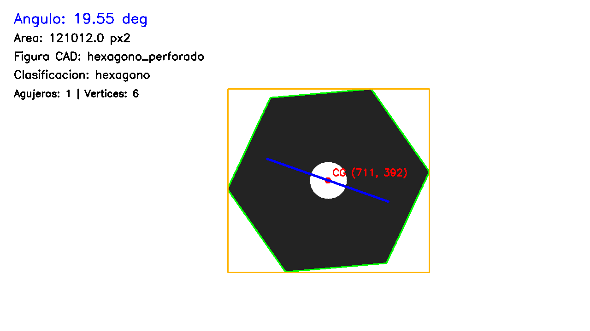
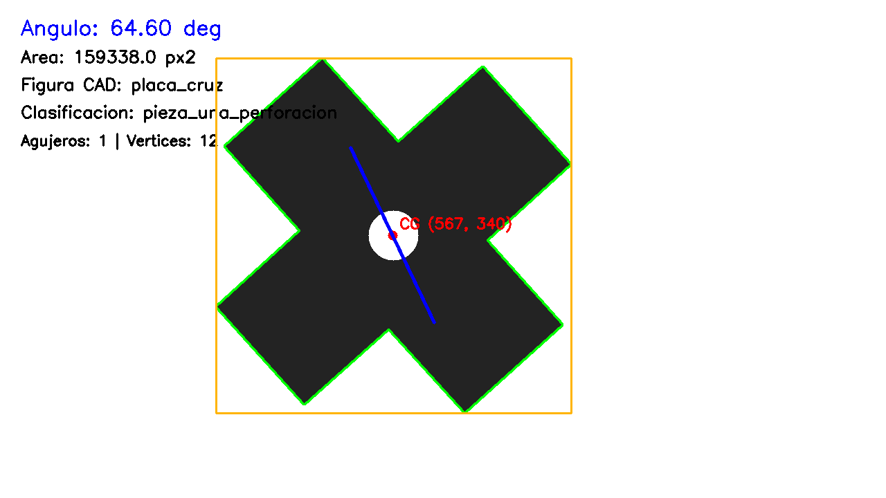
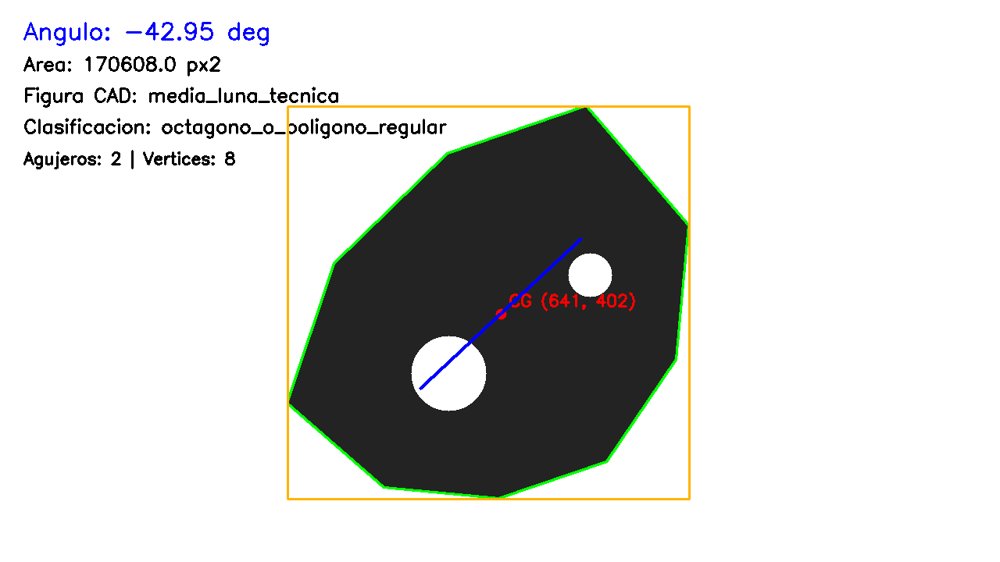

### Anexo F. Hoja de MathCAD o captura de cálculos


